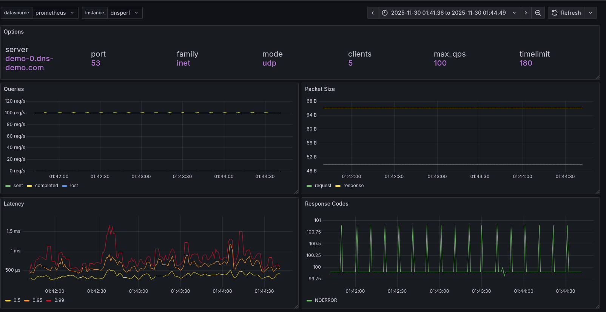

# `dnsperf`statistics to Prometheus Metrics Converter

This tool parses `dnsperf` statistics output and converts them to Prometheus metrics, which can be sent to a Prometheus-compatible system using the remote write protocol.

## Features

- Parses `dnsperf` interval statistics from output files
- Converts statistics to Prometheus metrics:
  - Query counts (sent, completed, lost)
  - Response codes
  - Packet sizes
  - Performance metrics (QPS, run time)
  - Latency metrics (average, stddev, histogram buckets)
- Sends metrics via Prometheus remote write protocol
- Supports dry-run mode for testing

## Installation

```bash
pip install -r requirements.txt
```

## Running `dnsperf` to Generate Statistics

To use this tool, you need to run `dnsperf` with specific options to generate interval statistics that can be parsed. The output should be saved to a file for processing.

### Required `dnsperf` Options

The following options are required to generate parseable output:

- `-O latency-histogram` - Enables latency histogram output
- `-O verbose-interval-stats` - Enables detailed interval statistics
- `-S <seconds>` - Interval statistics reporting interval (e.g., `-S 1` for every second)
- `-O suppress=timeout,unexpected` - Suppresses timeout and unexpected error messages (optional, for cleaner output)

### Example Command

Here's an example command to run dnsperf:

```bash
dnsperf -f inet -m udp \
  -s demo-0.dns-demo.com \
  -p 53 \
  -c 1 \
  -l 60 \
  -Q 100 \
  -d /path/to/dns-records.txt \
  -O latency-histogram \
  -O verbose-interval-stats \
  -S 1 \
  -O suppress=timeout,unexpected \
  > dnsperf-stats.txt 2>&1
```

### Command Line Options Explained

- `-f inet` - Use IPv4 (inet) address family
- `-m udp` - Use UDP protocol
- `-s <server>` - DNS server hostname or IP address
- `-p <port>` - DNS server port (default: 53)
- `-c <clients>` - Number of concurrent clients
- `-l <seconds>` - Test duration in seconds
- `-Q <qps>` - Target queries per second
- `-d <file>` - File containing DNS query records (one per line, format: `domain.com A`)
- `-O latency-histogram` - **Required**: Enable latency histogram output
- `-O verbose-interval-stats` - **Required**: Enable interval statistics
- `-S <seconds>` - **Required**: Statistics reporting interval (e.g., `-S 1` for every second)
- `-O suppress=timeout,unexpected` - Optional: Suppress timeout and unexpected error messages

### Redirecting Output

Save the output to a file for parsing:

```bash
# Redirect both stdout and stderr to a file
dnsperf [options] > dnsperf-stats.txt 2>&1
```

The output file will contain:
- Command line information
- Interval statistics for each reporting period
- Final summary statistics

This file can then be processed by `dnsperf_to_prometheus.py`.

## Usage

### Basic Usage

```bash
python dnsperf_to_prometheus.py input_file.txt --remote-write-url http://prometheus:9090/api/v1/write
```

### With Authentication Headers

```bash
python dnsperf_to_prometheus.py input_file.txt \
  --remote-write-url http://prometheus:9090/api/v1/write \
  --remote-write-header "Authorization=Bearer YOUR_TOKEN"
```

### With Custom Instance Label

```bash
python dnsperf_to_prometheus.py input_file.txt \
  --remote-write-url http://prometheus:9090/api/v1/write \
  --instance-label "my-dns-server"
```

By default, all metrics are labeled with `instance="dnsperf"`. Use `--instance-label` to customize this value.

### Dry Run (Test Without Sending)

```bash
python dnsperf_to_prometheus.py input_file.txt \
  --remote-write-url http://prometheus:9090/api/v1/write \
  --dry-run
```

## Metrics Exported

The following Prometheus metrics are created for each interval:

**Counter Metrics (Cumulative):**
- `dnsperf_queries_sent_total` - Cumulative total queries sent (accumulated across intervals)
- `dnsperf_queries_completed_total` - Cumulative total queries completed (accumulated across intervals)
- `dnsperf_queries_lost_total` - Cumulative total queries lost (accumulated across intervals)
- `dnsperf_response_codes_total{code}` - Cumulative response count by code (accumulated across intervals)

**Histogram Metrics (Prometheus Histogram):**
- `dnsperf_latency_seconds_bucket{le}` - Latency histogram buckets with cumulative counts (accumulated across intervals)
- `dnsperf_latency_seconds_sum` - Cumulative sum of all latency values (accumulated across intervals)
- `dnsperf_latency_seconds_count` - Cumulative count of latency observations (accumulated across intervals)

**Note:** The latency metrics form a complete Prometheus histogram with `_bucket`, `_sum`, and `_count` components. Buckets are cumulative (each bucket includes all observations <= its `le` value) and accumulate across intervals. This enables standard Prometheus histogram queries like percentiles and averages.

**Gauge Metrics (Per-Interval):**
- `dnsperf_packet_size_request_bytes` - Average request packet size
- `dnsperf_packet_size_response_bytes` - Average response packet size
- `dnsperf_run_time_seconds` - Run time for interval
- `dnsperf_queries_per_second` - Queries per second
- `dnsperf_latency_seconds_avg` - Average latency
- `dnsperf_latency_seconds_stddev` - Latency standard deviation

**Note:** 
- Metrics with `_total` suffix are cumulative counters that accumulate values across all intervals. Each interval adds its value to the running total from previous intervals. This follows Prometheus counter metric conventions.
- `dnsperf_latency_seconds_sum` is calculated from latency buckets by using the midpoint of each bucket range multiplied by the count, then accumulated across intervals. This enables calculation of average latency using `rate(dnsperf_latency_seconds_sum[5m]) / rate(dnsperf_queries_completed_total[5m])`.

## Example

```bash
# Parse sample file and send to Prometheus
python dnsperf_to_prometheus.py samples/dnsperf-stats.txt \
  --remote-write-url http://localhost:9090/api/v1/write
```

## Setting Up Prometheus with Remote Write Receiver

To receive metrics via remote write, Prometheus must be started with the remote write receiver feature enabled (Prometheus 2.33+).

**Important:** The included configuration enables out-of-order sample ingestion to accept historical timestamps from dnsperf statistics files. This requires Prometheus 2.39+ and is configured via `storage.tsdb.out_of_order_time_window` in the Prometheus configuration file.

### Using Docker/Podman

```bash
# Start Prometheus with remote write receiver enabled
cd prometheus
./start-prometheus.sh prometheus.remote-write.yml
```

Or manually:

```bash
docker run -d \
  --name prometheus \
  -p 9090:9090 \
  -v $(pwd)/prometheus/prometheus.remote-write.yml:/etc/prometheus/prometheus.yml:ro,Z \
  quay.io/prometheus/prometheus:latest \
  --config.file=/etc/prometheus/prometheus.yml \
  --web.enable-remote-write-receiver
```

Note: The `:Z` flag is for SELinux context. If you're not using SELinux, you can remove it. Also ensure the config file has read permissions (chmod 644).

### Using Systemd (Native Installation)

Edit your Prometheus service file to include the feature flag:

```ini
ExecStart=/usr/bin/prometheus \
  --config.file=/etc/prometheus/prometheus.yml \
  --storage.tsdb.path=/var/lib/prometheus \
  --web.enable-remote-write-receiver
```

### Verify Remote Write Receiver

Once Prometheus is running, you can verify the remote write endpoint is available:

```bash
curl http://localhost:9090/api/v1/write
# Should return: 405 Method Not Allowed (POST is required, but endpoint exists)
```

The remote write endpoint will be available at: `http://prometheus-host:9090/api/v1/write`

## Grafana Dashboard

A sample Grafana dashboard is included in the `grafana/` directory. This dashboard provides visualizations for all the `dnsperf` metrics including:

- Query rates and completion statistics
- Latency percentiles and histograms
- Response code breakdowns
- Packet size metrics

### Dashboard Preview



### Importing the Dashboard

1. In Grafana, go to **Dashboards** → **Import**
2. Click **Upload JSON file** and select `grafana/Performance with dnsperf-1764359872777.json`
3. Select your Prometheus data source
4. Click **Import**

Alternatively, you can copy the JSON content and paste it into the import dialog.

## Requirements

- Python 3.7+
- See `requirements.txt` for Python dependencies
- Prometheus 2.33+ for remote write receiver support

## Notes

- The `interval` label corresponds to the interval number from the `dnsperf` output
- Latency buckets use the upper bound as the `le` (less than or equal) label value
- The tool processes all interval statistics found in the input file
- Prometheus must be started with `--web.enable-remote-write-receiver` to accept remote write requests
- The included Prometheus configuration enables out-of-order sample ingestion (requires Prometheus 2.39+) to accept historical timestamps
- If you're using an older Prometheus version (< 2.39), you may need to use current timestamps or upgrade Prometheus
- Ensure the config file has read permissions (chmod 644) and proper SELinux context if using SELinux
